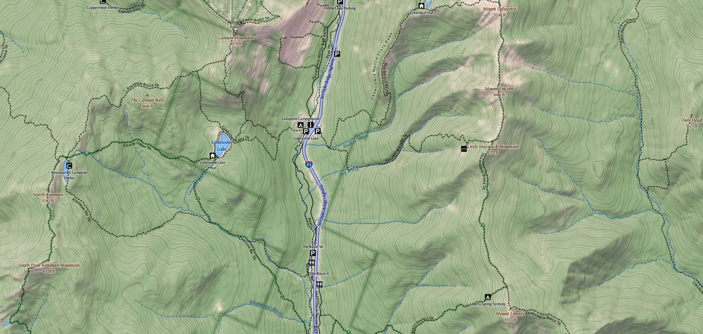

# Hikemap #

**Work in progress**

Styles and scripts for rendering a topographic hiking map based on OpenStreetMap.
In part based on earlier work from
[TopOSM](https://github.com/Ahlzen/TopOSM) and
[TopOSM2](https://github.com/Ahlzen/TopOSM2).




## Requirements ##

* postgresql with postgis
* tilestache (with python3 support)
* python3 with numpy, scipy, pil
* nodejs and carto, blit
* optipng (optional; for tile size optimization)


For Ubuntu 22.04 LTS, these packages get you most of the way:

`sudo apt install postgresql postgresql-client postgresql-14-postgis-3 postgis wget python3-numpy python3-sympy python3-scipy python3-pil proj-bin libmapnik3.1 mapnik-utils unzip parallel fonts-dejavu fonts-dejavu-extra fonts-liberation fonts-sil-gentium fonts-sil-gentium-basic fonts-larabie-straight nodejs npm optipng libjpeg-turbo-progs imagemagick`

`sudo npm install -g carto`


#### GDAL/OGR ####

NHD data is distributed in FileGDB format, which is only supported in `gdal` 1.11 or later. This may not available for your distro. If not, [instructions for building a more recent GDAL are here](http://trac.osgeo.org/gdal/wiki/BuildHints).

TODO.


#### Blit ####

Required for certain tilestache providers. Install with NPM.

`sudo npm install -g blit`


#### Google Fonts ####

Hikemap uses a few high-quality open font families available from [Google Fonts](https://www.google.com/fonts):

* Alegreya
* Alegreya Small Caps
* Alegreya Sans
* Alegreya Sans Small Caps

Install with a font manager like fnt, or download from [Google Fonts on Github](https://github.com/google/fonts)


(by default Mapnik expects .ttf files under /usr/share/fonts/truetype)


## Download and Process Data ##


#### Configure environment ####

Edit the `config` file and change the settings to match your environment. You can adjust the map extents here, which determines the area for which data is downloaded and rendered, as well as zoom levels to render.


#### Data Sources ####

Hikemap uses the following data sources:

* OpenStreetMap - roads, trails, mountain peaks and most other features)
* National Elevation Dataset (NED) - hillshading and contour lines
* National Hydrographic Dataset (NHD) - streams, rivers, lakes and wetlands
* National Land Cover Tree Canopy Data - tree coverage
* OSM Water Polygons - aids ocean rendering

Run the `get_data` script to download above data files for the configured area. The `process_data` script will perform the necessary reprojection, image processing and generation/import of vector features. Make sure you have plenty of disk space.

```
get_data
process_data
```

#### OSM Data Import ####

Hikemap includes a .style and .lua script for `osm2pgsql`, to select certain tags and perform some additional pre-processing during data import that simplifies rendering. Hstore is not required.

There is also a script that adds a few indexes to speed up certain queries.

To import an OSM extract, you would do something like:

```
. config
osm2pgsql -c -s -p $OSM_TABLE_PREFIX --drop -S hikemap.style --keep-coastlines --tag-transform-script hikemap_tagtransform.lua data/osm/us-northeast-latest.osm.pbf
./create_osm_indexes
```


## Processing Sources ##

The `process_sources` script builds the mapnik XML style files and tilestache.conf from the source files under `sources/`.


#### Testing ####

TileStache comes with a simple server that you can use to test the supplied tilestache.conf:

```
tilestache-server --config=processed/tilestache.cfg
```

The [tilestache documentation](http://tilestache.org/doc/) describes how to serve tiles using web servers more suitable for production.

Alternatively, the included 'seed' script can be used to pre-render a set of tiles for the configured area and zoom levels.
